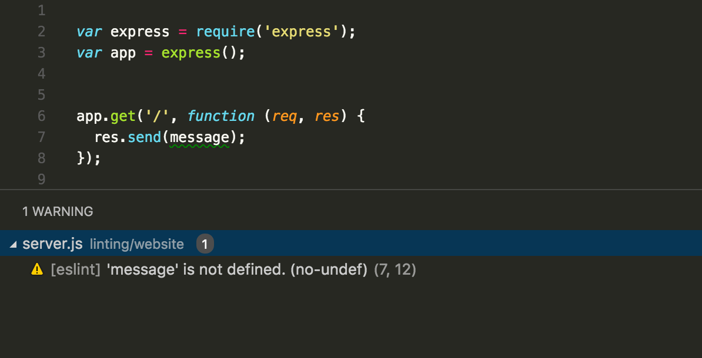

## JavaScript Tooling and Editor

<br>
<small>
by Peter Cosemans<br>
Copyright (c) 2017-2018 Euricom nv.
</small>

<!-- markdownlint-disable -->

<style type="text/css">
.reveal h1 {
    font-size: 3.0em;
}
.reveal h2 {
    font-size: 2.00em;
}
.reveal h3 {
    font-size: 1.00em;
}
.reveal p {
    font-size: 70%;
}
.reveal blockquote {
    font-size: 80%;
}
.reveal pre code {
    display: block;
    padding: 5px;
    overflow: auto;
    max-height: 800px;
    word-wrap: normal;
    font-size: 90%;
}
</style>

---

# It's not your daddies JavaScript anymore

> Tooling will help us

----

## Tooling

- ***NodeJS*** - Cross-platform JavaScript runtime environment.
- ***Npm*** - JavaScript module package manager
- ***Babel*** - ES6+ to JavaScript transpiler
- ***Prettier*** - An opinionated code formatter
- ***Linting*** - Analyse your code for potential errors
- ***WebPack*** - Task runner and module bundler.

---

# GIT

Git is used everywhere

- All open source projects
- All JavaScript libraries
- Default support in IDE & editors
- All npm modules are stored on github
- All content of this workshop :)

----

# GIT

Clone this repo

```
mkdir git
cd git
git clone https://github.com/Euricom/training-workshop-ES-React-2018Q3.git
cd training-workshop-ES-React-2018Q3
```

Get latest version of repo

```
cd training-workshop-ES-React-2018Q3
git pull
```

----

# GIT

3th party git tools

- [SourceTree](https://www.sourcetreeapp.com/)
- [Gitkraken](https://www.gitkraken.com/)

---

# Markdown

> The text format for developers

----

## Markdown

All slides and documentation is in markdown

```markdown
# Header 1
## Header 2

Unordered

+ Create a list by starting a line with `+`, `-`, or `*`
+ Sub-lists are made by indenting 2 spaces

Ordered

1. Lorem ipsum dolor sit amet
2. Consectetur adipiscing elit
3. Integer molestie lorem at massa

```

See Also [here](https://guides.github.com/features/mastering-markdown/) and [here](https://github.com/adam-p/markdown-here/wiki/Markdown-Cheatsheet)

----

# Markdown

Tools

- [VSCode](https://code.visualstudio.com/)
- http://markdownpad.com
- https://caret.io/

Online Tools

- https://dillinger.io/
- https://stackedit.io/editor

---

# NodeJS

> Your Javascript engine for the desktop

----

## NodeJS - Active LTS or Current

To Install
[https://nodejs.org/en/](https://nodejs.org/en/)

<br>

[https://github.com/nodejs/Release#release-schedule](https://github.com/nodejs/Release#release-schedule)

----

### Multiple node versions

MacOS

    // install
    $ npm install n -g

    // use
    $ n latest
    $ n

Windows / MacOS

[https://github.com/coreybutler/nvm-windows/releases](https://github.com/coreybutler/nvm-windows/releases)

    // use
    $ nvm list available
    $ nvm install 4.4.5
    $ nvm use 4.4.5

----

## NPM
### Node Package Manager

The JavaScript way of packaging and deploying code (modules)

```bash
# versions
$ node --version      # node version
$ npm --version       # npm version

# to create a package.json
$ npm init

# to install a module
$ npm install jquery

# to install all modules defined in the package.json
$ npm install

# to remove a module
$ npm uninstall jquery --save
```

----

## Npm Commands

Other usefull commands

```bash
npm init
npm install eslint --save-dev   # install as desdependency
npm list --depth=0              # list local install packages
npm list --depth=0 -g           # list global install packages
npm cache clean                 # clear cache
npm config list                 # show configs
npm install -g npm@latest       # upgrade npm to latest version
```

----

## Npm Config

```bash
$ npm config list       # show config
$ npm config list -l    # show full config
$ npm config get cache  # show single config item
$ npm config set cache
```

Location of npm config file

```bash
# local config
$ npm config get userconfig

# global config (by default not available)
$ npm config get globalconfig
```

----

## Npm Registry

All modules are installed from npm registry

```bash
$ npm config get registry
$ npm config set registry <registry url>
```

Specify a different source

```bash
npm install (with no args, in package dir)
npm install [<@scope>/]<pkg>
npm install [<@scope>/]<pkg>@<tag>
npm install [<@scope>/]<pkg>@<version>
npm install [<@scope>/]<pkg>@<version range>
npm install <folder>
npm install <tarball file>
npm install <tarball url>
npm install <git:// url>
npm install <github username>/<github project>
```

----

## Npm scripts

You can run small CLI script via npm/yarn

```json
{
    "name": "temp",
    "version": "1.0.0",
    "scripts": {
        "start": "node main.js"
    },
    ...
}
```

To run

```bash
$ npm run start
my-project@1.0.0 start /Users/my-user/git/my-project
> node main.js
```

----

## Npx

Executor for local and ad-hoc npm binaries

```bash
# add a local package
yarn add cowsay

# run local package
npx cowsay May the force be with you

# run remote package (this will install, run and uninstall)
npx https://gist.github.com/zkat/4bc19503fe9e9309e2bfaa2c58074d32
```

> Now you don't have to install tools globally or create a script line.

----

## Yarn

Yarn (fast, reliable and secure) alternative to npm

```bash
# install (npm install jquery)
$ yarn add jquery

# install all modules from package.json (npm install)
$ yarn

# uninstall jquery (npm uninstall)
$ yarn remove jquery

# run a script
$ yarn start

# others
$ yarn info jquery              # show information about package
$ yarn add jquery@2.2.4         # install jquery v2.2.4
$ yarn outdated                 # show which packages are outdated
$ yarn upgrade-interactive      # interactive upgrade all modules
```

---

# Babel

> Use the latest and greatest of ESNext

----

## Setup

[Using Babel (official website)](https://babeljs.io/docs/setup/)

Install

```bash
# install as npm module
yarn add babel-cli --dev
yarn add babel-preset-env babel-preset-react --dev
yarn add babel-preset-stage-2 --dev
```

Configure: .babelrc

```json
{
  "presets": [
    "env",        // which browser to support
    "react"       // handles jsx and flow support
    "stage-2"     // latest ES+ features
  ]
}
```

----

## Customize

.babelrc

```json
{
  "presets": [
    ["env", { "targets": { "browsers": ["last 2 versions"] } }],
    "react"
  ]
}
```

Babel will transpile to JavaScript that runs on the last two version of all the browsers.

----

## Test your Setup

Sample Code

```js
const a = { name: 'peter'}
const b = {
    ...a,
    localtion: 'lint'
}
console.log(b)
```

To build

```bash
npx babel main.js
```

To run

```bash
npx babel-node main.js
```

----

## WebPack

For the browser we need to compile and bundle the javascript.

```bash
yarn add webpack webpack-cli babel-loader --dev
```

webpack.config.js

```js
module.exports = {
  entry: './main.js',
  mode: 'development',
  output: { path: __dirname, filename: 'bundle.js' },
  module: {
    rules: [
      {
        test: /.{js,jsx}?$/,
        loader: 'babel-loader',
        exclude: /node_modules/,
      },
    ],
  },
};
```

Build and bundle

```bash
npx webpack
```

---

# Formatting

> Always us a code formatter

----

## Prettier

Use [https://prettier.io/](Prettier) to format your code.

```js
// Input
foo(reallyLongArg(),omgSoManyParameters(), IShouldRefactorThis(), isThereSeriouslyAnotherOne()
);
```

```js
// Ouput
foo(
  reallyLongArg(),
  omgSoManyParameters(),
  IShouldRefactorThis(),
  isThereSeriouslyAnotherOne()
);
```

----

## VSCode - Plugin

Install VSCode plugin<br>

<br>

[Prettier - Code formatter](https://marketplace.visualstudio.com/items?itemName=esbenp.prettier-vscode)

----

## Config

Config file: ```.prettierrc```

```
{
  "trailingComma": "all",
  "singleQuote": true,
  "tabWidth": 2,
  "printWidth": 80,
  "useTabs": false,
  "semi": true
}

```

Ignore file: ```.prettierignore```

```
package.json
node_modules/**/*
```


---

# Linting

> Don't start without it.

----

## Use a linter

Static code analyses to improve your code.

<br>

Available to JavaScript (ESLint), TypeScript (TSLint) and CSS (StyleLint)

----

## IDE/Editor Support

Any good JS editor support's linting

* Visual Studio Code
* WebStorm
* Atom

<br>

----

# ESLint

> The pluggable linting utility for JavaScript and JSX

----

## ESLint - Setup

```bash
# linter engine
yarn add eslint@4 --dev
## eslint config
yarn add eslint-config-airbnb eslint-plugin-react  --dev
yarn add eslint-plugin-jsx-a11y eslint-plugin-import  --dev
```

.eslintrc

```json
{
  "extends": ["airbnb"],
  "globals": {},
  "env": {
    "es6": true,
    "node": true
  },
  "rules": {
    "strict": [0],        // use strict is required for commonjs
    "no-console": [0, ""] // allow console.log
  }
}

```

Add npm script

```json
scripts: {
    "lint": "eslint \"**/*.js\""
}
```

<small>This setup follow the airbnb styleguide: https://github.com/zalmoxisus/javascript</small>

----

## ESlint - VSCode


[ESLint Plugin](https://marketplace.visualstudio.com/items?itemName=dbaeumer.vscode-eslint)

----

### ESLint - Disable styling rules

When using Prettier you can disable all formatting rules

```bash
# install additional eslint config
$ yarn add eslint-config-prettier --dev
```

.eslintrc

```json
{
  "extends": [
      "airbnb",
      "prettier"
  ],
  ...
}
```

No more linting errors for formatting.

---

## Starters

Pre-defined projects for easy startup. Where to find?

```
<root>/starter/js-react-webpack
<root>/starter/js-react-webpack-full
```

Ready to:

* Run any React/ES6+ in browser
* Prettier setup
* Linting with AirBnb config
* Editorconfig for consistent tabs/spacing
* Usefull VSCode setup

---

# Ready to write some JavaScript
