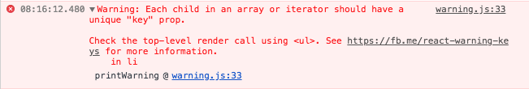
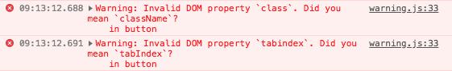

# React

## Introduction

<br>

<small>
by Peter Cosemans<br>
Copyright (c) 2018 Euricom nv.
</small>

<!-- markdownlint-disable -->
<style type="text/css">
.reveal section img {
    background:none;
    border:none;
    box-shadow:none;
}
.reveal h1 {
    font-size: 3.0em;
}
.reveal h2 {
    font-size: 2.00em;
}
.reveal h3 {
    font-size: 1.00em;
}
.reveal p {
    font-size: 70%;
}
.reveal blockquote {
    font-size: 100%;
}
.reveal pre code {
    display: block;
    padding: 5px;
    overflow: auto;
    max-height: 800px;
    word-wrap: normal;
    font-size: 100%;
}
</style>

---

# Prepare yourself

> It's not your jquery anymore

<!-- prettier-ignore -->
***

## Learn JavaScript

> A large part of knowning React is knowing JavaScript. <br>
> React is using the latest ES features

### Make sure you know:

- ES Modules
- (Arrow) Functions & Classes
- Promises
- Spread operators, destructering
- This reference
- Linting with ESlint & VSCode

<br>

<!-- prettier-ignore -->
***

## Training

### JavaScript

- [Deep JavaScript Foundations V2](https://frontendmasters.com/courses/javascript-foundations/) @FrontEndMasters
- [ES6 for Everyone](es6.io) from @wesbos
- [Let’s Learn ES6](https://www.youtube.com/watch?v=LTbnmiXWs2k&list=PL57atfCFqj2h5fpdZD-doGEIs0NZxeJTX) at @YouTube

<br>

### Tooling

- [Building a JavaScript Development Environment](https://app.pluralsight.com/library/courses/javascript-development-environment/table-of-contents)

---

# You first App

> It's easy

<!-- prettier-ignore -->
***

## Getting started

index.html

```html
<body>
  <!-- entry point of the app -->
  <div id="root"></div>
  <!-- bundle is create by webpack -->
  <script src="bundle/bundle.js"></script>
</body>
```

Install dependencies

```bash
yarn install react react-dom
yarn install babel-preset-react --dev
```

index.js

```jsx
// import the dependenciess
import React from 'react';
import ReactDOM from 'react-dom';

// create your App component
const App = () => <h1>My React App</h1>;

// render the app
ReactDOM.render(<App />, document.getElementById('root'));
```

<!-- prettier-ignore -->
***

## babel

Install dependencies

```bash
yarn install babel-preset-react --dev
```

.babelrc

```json
{
  "presets": ["env", "react"]
}
```

<!-- prettier-ignore -->
***

## webpack

webpack.conf.js (pretty standard)

```bash
module.exports = {
  entry: './src/index.js',
  output: { path: __dirname, filename: 'bundle.js' },
  module: {
    rules: [
      {
        test: /\.(js|jsx)$/,
        loader: 'babel-loader',
        exclude: /node_modules/,
      },
    ],
  },
  resolve: {
    extensions: ['.js', '.jsx'],
  },
};
```

<!-- prettier-ignore -->
***

## Build and startup

package.json

```json
"scripts": {
    "serve": "webpack-dev-server --open --inline --hot",
    "build": "webpack",
    "build:prod": "webpack -p",
}
```

commands

```bash
# run in development
yarn serve

# build (development)
yarn build

# build for production
yarn build:prod
```

---

# JSX

> Writing HTML with JSX

<!-- prettier-ignore -->
***

## JSX

### It's Javascript ++

```jsx
// import the dependenciess
import React from 'react';
import ReactDOM from 'react-dom';

// create a template with JSX
const template = <h1>My First React App</h1>;

// get element '<div id="root"></div>'
const appRoot = document.getElementById('app');

// render (bootstrap) the app
ReactDom.render(template, appRoot);
```

<!-- prettier-ignore -->
***

## CreateElement

This

<!-- prettier-ignore -->
```jsx
const template = <h1>My Title</h1>;
ReactDom.render(template, document.getElementById('app'));
```

is translated into

<!-- prettier-ignore -->
```js
var template = React.createElement(
  'h1',
  null,
  'My First React App'
);
ReactDom.render(template, document.getElementById('app'));
```

See also [Babel REPL](https://babeljs.io/repl/#?babili=false&browsers=&build=&builtIns=false&spec=false&loose=false&code_lz=MYewdgzgLgBFCmBbADgGwIYJgXhgCgCgYYAeACwEYA-I4mAWQE8YAxASwCdoYAledYLACCyZLRIB6SjQCUAbgJ8BUACIhEAOg7wwAE3gc8CFBgQAaGLpDAAroh1QNAc3hQAoqiQOAQowCSungA5OiiQTLyQA&debug=false&forceAllTransforms=false&shippedProposals=false&circleciRepo=&evaluate=false&fileSize=false&sourceType=module&lineWrap=true&presets=es2015%2Creact%2Cstage-2&prettier=false&targets=&version=6.26.0&envVersion=)

<!-- prettier-ignore -->
***

## One Root Element

```jsx
const template = <h1>My Title</h1><p>May the Force be with you</p>;

// --> ERROR: Adjacent JSX elements must be wrapped in an enclosing tag
```

Valid JSX has only one root element

```js
const template = (
  <div>
    <h1>My Title</h1>
    <p>May the Force be with you</p>
  </div>
);
```

> Use Parentheses for readability

<!-- prettier-ignore -->
***

### Embedding Expressions

```jsx
const name = 'peter';
const url = 'https://placeimg.com/200/200/animals';
const imageWidth = 500;
const customer = {
  name: 'euricom',
  location: 'mechelen',
};
function formatCustomer(customer) {
    return `${customer.name}: ${customer.location}`;
}
const template = (
  <div>
    <p>{user}</p>
    <p>{customer.name}</p>
    <p>{user.toUpperCase()}</p>
    <p>{formatCustomer(customer)</p>
    
  </div>
);
```

Everything between `{ .... }` is JavaScript code.

<!-- prettier-ignore -->
***

### Not everything is rendered

Booleans, Null, and Undefined Are Ignored

```jsx
<div />
<div></div>
<div>{false}</div>
<div>{null}</div>
<div>{undefined}</div>
<div>{true}</div>
```

A comment

```jsx
<!-- This wont work -->
{ /* Single line: Single line */ }
{ /* Multi line: this will work also :)
    <div>

    </div>
 */}
```

An object can't be rendered

```jsx
<p>customer</p>    { /* this throws an error */ }
```

<!-- prettier-ignore -->
***

## Conditional rendering

ternary operator

```jsx
const template = <p>User: {user.name ? user.name : 'no-name'}</p>;
```

logical and operator

```jsx
const template = (
	{user.age && user.age >= 18 && <p>Age: user.age</p>}
)
```

<!-- prettier-ignore -->
***

### Conditional rendering

switch

```jsx
const template = notification({ text: 'hello', state: 'info' });

function notification({ text, state }) {
  switch (state) {
    case 'info':
      return <Info text={text} />;
    case 'warning':
      return <Warning text={text} />;
  }
  return null;
}
```

<!-- prettier-ignore -->
***

### Conditional rendering

inline switch (with iife)

```jsx
const template = (
  <div>
    {(function() {
      switch (state) {
        case 'info':
          return <Info text={text} />;
        case 'warning':
          return <Warning text={text} />;
      }
      return null;
    })()}
  </div>
);
```

need more?

[All the Conditional Renderings in React](https://www.robinwieruch.de/conditional-rendering-react/)

<!-- prettier-ignore -->
***

## Arrays

Render a Array

```jsx
const names = ['john', 'peter', 'bob'];
const template = (
	names: { names }
)
```

Ouput

```
names: johnpeterbob
```

Identical to

```jsx
const template = (
	names: {'john'}{'peter'}{'bob'}
)
```

<!-- prettier-ignore -->
***

### Arrays

You can render JSX in JSX

```jsx
const template = (
  <ul>
    {<li>item1</li>}
    {<li>item1</li>}
  </ul>
);
```

Ouptut

```html
<ul>
    <li>item1</li>
    <li>item2</li>
</ul>
```

<!-- prettier-ignore -->
***

### Arrays

create array of jsx (reactElements)

```jsx
const names = ['john', 'peter', 'bob'];
const listItems = names.map(name => {
  return <li>{name}</li>;
});
```

<!-- prettier-ignore -->
```jsx
const template = (
  <ul>{listItems}</ul>
)
```

or

```jsx
const names = ['john', 'peter', 'bob'];
const template = (
  <ul>
    {names.map(name => {
      return <li>{name}</li>;
    })}
  </ul>
);
```

<!-- prettier-ignore -->
***

### Arrays

Oops, we have an error



fix

```jsx
const names = ['john', 'peter', 'bob'];
const template = (
  <ul>
    {names.map(((name, index) => {
      return <li key={index}>{name}</li>;
    })}
  </ul>
);
```

<!-- prettier-ignore -->
***

### Arrays

Typical use

<!-- prettier-ignore -->
```jsx
const users = [
    { id: 1, name: 'john' }
    { id: 2, name: 'peter' }
    { id: 3, name: 'bob' }
]
const template = (
  <ul>
    {users.map(user => <li key={user.id}>{user.name}</li>)}
  </ul>
);
```

> Try to avoid map index when possible!

[More info](https://reactjs.org/docs/lists-and-keys.html#keys)

<!-- prettier-ignore -->
***

## JSX vs DOM elements

```jsx
const template = (
  <div>
    <
    <button type="button" id="btn1" class="btn" tabindex="2">
      Click me
    </button>
  </div>
);
```

Oops errors



JSX is still JavaScript, can't use reserved keywords.

ESLint will also capture these errors (config !)

<!-- prettier-ignore -->
***

### JSX vs DOM elements

fix

<!-- prettier-ignore -->
```jsx
const template = (
  <div>
    <button type="button" id="btn1"
            className="btn" tabIndex="2">
      Click me
    </button>
  </div>
);
```

No Reserved keywords and camel-cased.

[React Supported DOM Elements](https://reactjs.org/docs/dom-elements.html)

### See also

- dangerouslySetInnerHTML

<!-- prettier-ignore -->
***

## Event Handling

```jsx
let counter = 0;
const addOne = event => {
  console.log('clicked', event);
};
const template = (
  <div>
    <button onClick={addOne}>+</button>
  </div>
);
```

Event are camel-cased.

The event handler will receive a [SyntheticEvent](https://reactjs.org/docs/events.html) <br> (a cross-browser wrapper around the browser’s native event)

Almost all browser [events](https://reactjs.org/docs/events.html#supported-events) are supported.

<!-- prettier-ignore -->
***

### Event Handling

This doesn't work

```jsx
let counter = 0;
const addOne = () => {
  console.log('clicked');
  counter = counter + 1;
};
const template = (
  <div>
    <p>{counter}</p>

    <button onClick={addOne}>+</button>
    <button onClick={() => counter--}>-</button>
  </div>
);
```

The `counter` is NOT automatically updated in the page.

> JSX doesn't support data binding! <br>Its just rendering the value.

<!-- prettier-ignore -->
***

### Event Handling

Fix

```jsx
let counter = 0;
const addOne = () => {
  console.log('clicked');
  counter = counter + 1;
};
render();

function render() {
  const template = (
    <div>
      <p>{counter}</p>

      <button onClick={addOne}>+</button>
      <button onClick={() => counter--}>-</button>
    </div>
  );
  ReactDOM.render(template, document.getElementById('root'));
}
```

The (virtual) DOM is rendered on every change!

<!-- prettier-ignore -->
***

## Virtual DOM vs DOM


Direct DOM manipulation is slow. Through the virtual DOM we only apply a patch for the diff.

---

# Components

> The building blocks of React

<!-- prettier-ignore -->
***

## App Components


<!-- prettier-ignore -->
***

## App Components

Abstract component tree

```html
<App>
    <Header/>
    <Navigation>
    <div>
        <Network>
            <Line />
        </Network>
        <Predictions>
            <DepartureBoard />
            <DepartureBoard />
        </Predictions>
    </div>
</App>
```

<!-- prettier-ignore -->
***

## Functional Component

```jsx
function Welcome(props) {
  return <h1>Welcome, {props.name}</h1>;
}
```

You can use the component in any JSX expression

```jsx
const template = (
  <div>
    <h1>Title</h1>
    <Welcome name="peter" />
  </div>
);
```

<!-- prettier-ignore -->
***

## Class Component

User-Defined Components names are Capitalized

```jsx
// Welcome.js
import React, { Component } from 'react';

class Welcome extends Component {
  render() {
    return <h1>Hello, {this.props.name}</h1>;
  }
}
```

JSX assumes a React object is available, so make sure to import it.

Place all components is separated files (capitalized)

<!-- prettier-ignore -->
***

## Compose Component

```jsx
// App.js
import React, { Component } from 'react';
import ReactDOM from 'react-dom';
import Welcome from './Welcome';

class App extends Component {
  render() {
    return (
      <div>
        <h1>Title</h1>
        <Welcome name="peter" />
        <Welcome name="bob" />
      </div>
    );
  }
}
ReactDOM.render(<App />, document.getElementById('root'));
```

<!-- prettier-ignore -->
***

## Props

With props we can pass data from parent to client component

```jsx
class App extends Component {
  customers: [{ id: 1, name: 'consonto' }, { id: 2, name: 'bellware' }];
  render() {
    return <MyComponent title="my title" cust={customers} />;
  }
}
```

```jsx
class MyComponent extends Component {
  render() {
    return (
      <div>
		<h3>{this.props.title}<h3>
      </div>
    );
  }
}
```

<!-- prettier-ignore -->
***

### Props

Props are passed via constructor

```jsx
class MyComponent extends Component {
  constructor(props) {
    super(props)
  }
  render() {
    return <h3>{this.props.title}<h3>;
  }
}
```

Or passed as argument on functional component

```jsx
function MyComponent(props) {
  return <h3>{props.title}<h3>;
}
```

<!-- prettier-ignore -->
***

### children prop

<!-- prettier-ignore -->
```jsx
function FancyButton(props) {
  return (
    <button className="FancyButton">
      {props.children}
    </button>
  );
}
```

```jsx
<FancyButton>Click Me</FancyButton>
```

<!-- prettier-ignore -->
***

### Props

Props are Read-Only

```jsx
class MyComponent extends Component {
  constructor(props) {
    super(props);
    // BAD: Error is thrown
    props.title = `-- ${props.title} --`;
  }
}
```

<!-- prettier-ignore -->
***

### Props

Validate your props

```jsx
import PropTypes from 'prop-types';

class MyComponent extends Component {

  static propTypes = {
    title:PropTypes.string.isRequired,
    count:PropTypes.number,
  };
  static defaultProps = {
    count: 10
  };

  render() {
    return (
	   <h3>{this.props.title}<h3>
    );
  }
}
```

[React prop-types](https://github.com/facebook/prop-types)

<!-- prettier-ignore -->
***

### Props

Validate functional components props

```jsx
import PropTypes from 'prop-types';

function MyComponent(props) {
  return (
    <h3>{this.props.title}<h3>
  );
}

MyComponent.propTypes = {
  title: PropTypes.string.isRequired,
  count: PropTypes.number,
};

MyComponent.defaultProps = {
  count: 10
};
```

This syntax can also be used on class components

<!-- prettier-ignore -->
***

## Event Handlers

```jsx
class MyComponent extends React {
  onClick() {
    console.log('clicked');
  }
  render() {
    return (
      <div>
        <h1>Title</h1>
        <button onClick={this.onClick}>Click Me</button>
      </div>
    );
  }
}
```

<!-- prettier-ignore -->
***

### Event Handlers

Be aware of the this reference

```jsx
class MyComponent extends React {
  constructor(props) {
    super(props);
    this.onClickFix1 = this.onClickFix1.bind(this);
  }

  onClick() {
    // BAD: this is not referencing the component
    console.log('props', this.props);
  }

  onClickFix1() {
    console.log('props', this.props);
  }

  onClickFix2 = () => {
    console.log('props', this.props);
  };
}
```

---

# State & Live Cycle

> It's not just a component

<!-- prettier-ignore -->
***

## Component State

```jsx
export default class MyComponent extends Component {
  state = {
    counter: 0,
  };
  addOne = () => {
    this.setState({
      counter: this.state + 1,
    });
  };
  render() {
    return (
      <div>
        <h3>{this.state.counter}</h3>
        <button onClick={this.addOne}>+</button>
      </div>
    );
  }
);
```

<!-- prettier-ignore -->
***

## Initialize State

Init state by prop

```jsx
export default class MyComponent extends Component {
  state = {
    counter: this.props.initialValue || 0,
  };
  // ...
}
```

Alternative via constructor

```jsx
export default class MyComponent extends Component {
  constructor(props) {
    super(props);
    state = {
      counter: props.initialValue || 0,
    };
  }
  // ...
}
```

<!-- prettier-ignore -->
***

## SetState

```jsx
// single value
this.setState({
  counter: 1,
});

// single update, complex state
// set state will always set the complete state
this.setState({
  ...this.state    // take all other state properties
  counter: 1,      // set counter to 1
});

// better: set by callback
this.setState((state) => ({
  ...state
  counter: 1,
}));
```

<!-- prettier-ignore -->
***

### SetState

```js
// Issue: state is asynchronous
this.setState({
  counter: this.state + 1,
});
console.log(this.state); // State may be not updated yet

// Fix: result callback
this.setState(
    (state, props) => ({
        ...state
        counter: props.initialValue,
    }),
    (state) => {
        // now the state is changed
        consoler.log('new state: ', state)
    }
);
```

<!-- prettier-ignore -->
***

### Calculated state fields

Don't use state for calculated fields

```jsx
export default class MyComponent extends Component {
  constructor(props) {
    this.state = {
      fullName: `${props.firstName} ${props.lastName}`,
    };
  }
  render() {
    return <p>{this.state.fullName}</p>;
  }
}
```

Better

```jsx
export default class MyComponent extends Component {
  render() {
    const fullName = `${this.props.firstName} ${this.props.lastName}`;
    return <p>{fullName}</p>;
  }
}
```

<!-- prettier-ignore -->
***

## Live Cycle Methods

```jsx
export default class MyComponent extends Component {
  constructor(props) {
    console.log('construction', props);
  }
  componentDidMount() {
    console.log('mounted');
  }
  componentDidUpdate(oldProps) {
    console.log('props changed', { oldProps, props: this.props });
  }
  componentWillUnmount() {
    console.log('bye-bye');
  }
  render() {
    return <p>Hello</p>;
  }
}
```

<!-- prettier-ignore -->
***

### Live Cycle


[React lifecycle methods diagram](http://projects.wojtekmaj.pl/react-lifecycle-methods-diagram/)

---

# Debugging

> Get that app under control

<!-- prettier-ignore -->
***

## Console.log

console logging is your friend

```js
// you can log an object
console.log(user);
```

```js
// log multiple vars
console.log(name + ' ' + age); // don't use this
console.log(name, age); // both are logged
console.log({ name, age }); // with names
```

```js
// log in table form
const users = [{ id: 1, name: 'peter' }, { id: 2, name: 'bob' }];
console.table(users);
```

<!-- prettier-ignore -->
***

## Console.log

others

```js
// timing
console.time('myTiming');
longRunningTask();
console.endTime('myTiming'); // OUTPUT: myTiming xxxxms
```

```js
// grouping
console.group('URL Details');
console.log('Scheme: ', schema);
console.log('Host: ', host);
console.groupEnd();
```

<!-- prettier-ignore -->
***

## Debugger

The chrome debugger is your best friend.


<!-- prettier-ignore -->
***

### Debugger

Make sure to generate source maps to view source in debugger

```js
// webpack.config.js
module.exports = {
  mode: 'development',
  output: {
    // ...
  },
  // eval: fast build & generated code
  // cheap-module-eval-source-map: slower build & orginal code
  // source-map: full source map files
  devtool: 'cheap-module-eval-source-map',
};
```

More info see
[WebPack DevTool](https://webpack.js.org/configuration/devtool/#devtool)

<!-- prettier-ignore -->
***

## React Dev Tools


[React Developer Tools](https://chrome.google.com/webstore/detail/react-developer-tools/fmkadmapgofadopljbjfkapdkoienihi)

---

# Http Requests

> Get the data

<!-- prettier-ignore -->
***

## Http in React

> React doens't provide a Http library.

#### 3th party libraries

- [Fetch API](https://developer.mozilla.org/en-US/docs/Web/API/Fetch_API/Using_Fetch) (standardized)
- [Axios](https://github.com/axios/axios) (most popular)
- [SuperAgent](https://visionmedia.github.io/superagent/)
- [Request](https://github.com/request/request)

<!-- prettier-ignore -->
***

## Axios

```js
import axios from 'axios';

axios
  .get('https://swapi.co/api/starships')
  .then(res => {
    // success
    console.log('result', res.data);
  })
  .catch(error => {
    if (error.response) {
      // The request was made and status code
      // that falls out of the range of 2xx
      console.log(error.response.data);
      console.log(error.response.status);
      console.log(error.response.headers);
    } else {
      // Something happened in setting up the request
      console.log('Error', error.message);
    }
  });
```

<!-- prettier-ignore -->
***

## Axios

post

```js
const todo = {
  userId: 1,
  title: 'write some code',
  completed: false,
};
const url = 'http://jsonplaceholder.typicode.com/todos';
axios.post(url, todo).then(res => {
  console.log('result', res.data);
});
```

delete

```js
const url = `http://jsonplaceholder.typicode.com/todos/${id}`;
axios.delete(url).then(res => {
  console.log('result', res.data);
});
```

<!-- prettier-ignore -->
***

## Axios

custom config

```js
// api.js
import axios from 'axios';
expost default axios.create({
  baseURL: 'https://some-domain.com/api/',
  timeout: 1000,
  headers: { 'X-Custom-Header': 'foobar' },
});
```

use

```js
// api/contact.js
import api from './api';

export default {
  async getById(id) {
    const res = await api.get(`contacts/${id}`);
    return res.data;
  },
};
```

<!-- prettier-ignore -->
***

## Axios in React

```jsx
import contactApi from './api/contacts';

export default class MyComponent extends Component {
  state = {
    contact: {},
  };
  async componentDidMount() {
    const contact = await contactApi.getById(1);
    setState({
      contact,
    });
  }
  render() {
    const { contact } = this.state;
    return (
      <div>
        <h1>Contact</h1>
        <Contact contact={contact} />;
      </div>
    );
  }
}
```

---

# Styling

> The building blocks of React

---

# Production

> Don't put your development in production

<!-- prettier-ignore -->
***

### NODE_ENV === "production"

The environment at build time is controlled by

```
// webpack.config.js
new webpack.DefinePlugin({
  'process.env.NODE_ENV': JSON.stringify('production')
}),
new webpack.optimize.UglifyJsPlugin()
```

during build you get an uptimized build to production.

for example:

```js
if (process.NODE_ENV === 'production') {
  // production mode
}
```

<!-- prettier-ignore -->
***

## Console.log

Don't allow console.log for Production!

.eslintrc.js

```js
module.exports = {
  // ...
  rules: {
    // only allowed in development
    'no-console': process.env.NODE_ENV === 'production' ? 2 : 0,
    'no-debugger': process.env.NODE_ENV === 'production' ? 2 : 0,
  },
};
```

package.json

```json
{
  "scripts": {
    "lint": "eslint src/**/*.js",
    "lint:prod": "cross-env NODE_ENV=production eslint src/**/*.js"
  }
}
```

<!-- prettier-ignore -->
***

## Loglevel

Minimal lightweight logging for JavaScript

```bash
# Add dependencies
yarn install loglevel
```

use

```js
import log from 'loglevel';

// Set the logLevel
log.setLevel(process.NODE_ENV === 'production' ? 'warn' : 'info');

// some other place in the program
log.warn('something is wrong here');
log.debug('details', result);
```

---

# Resources

Training

- [REACT FOR BEGINNERS](https://reactforbeginners.com/)
  from @wesbos
- [The Beginner’s Guide to React](https://egghead.io/courses/the-beginner-s-guide-to-react) from @kentcdodds

Libraries

- [React Helmet](https://github.com/nfl/react-helmet) - A document head manager

Info

- https://www.sitepoint.com/redux-vs-mobx-which-is-best/
- [Beware: React setState is asynchronous!](https://medium.com/@wereHamster/beware-react-setstate-is-asynchronous-ce87ef1a9cf3)

---

# Ready to build you React Apps
