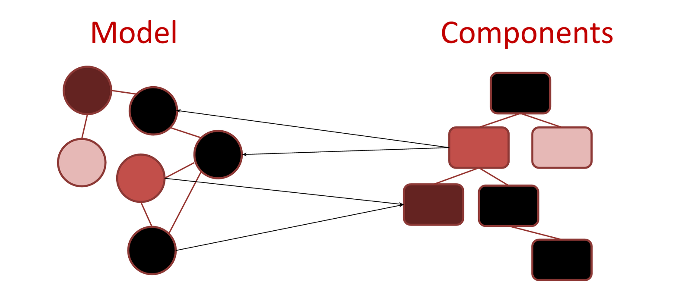

# React

## State Management

<br>

<small>
by Peter Cosemans<br>
Copyright (c) 2018 Euricom nv.
</small>

<!-- markdownlint-disable -->
<style type="text/css">
.reveal section img {
    background:none;
    border:none;
    box-shadow:none;
}
.reveal h1 {
    font-size: 3.0em;
}
.reveal h2 {
    font-size: 2.00em;
}
.reveal h3 {
    font-size: 1.00em;
}
.reveal p {
    font-size: 70%;
}
.reveal blockquote {
    font-size: 100%;
}
.reveal pre code {
    display: block;
    padding: 5px;
    overflow: auto;
    max-height: 800px;
    word-wrap: normal;
    font-size: 100%;
}
</style>

---

## MobX


https://mobx.js.org/

<!-- prettier-ignore -->
***

## Setup

```bash
yarn add babel-plugin-transform-decorators-legacy --dev
```

```json
// .babelrc
{
  ...
  "plugins": ["transform-decorators-legacy"]
}
```

```bash
yarn add mobx mobx-react
```

```js
// src/stores/myStore
import { observable, action, computed } from 'mobx';

class MyStore {
  @observable birds = [];

  @action
  addBird = bird => {
    this.birds.push(bird);
  };

  @computed
  get birdCount() {
    return birds.length;
  }
}

const store = new MyStore();
export default store;
```

```jsx
// index.js
import { Provider} from 'mobx-react'
import BirdStore from './stores/myStore'

const Root = {
    <Provider BirdStore={MyStore}>
        <App/>
    </Provider>
}

ReactDOM.render(Root, ...)
```

```jsx
// App.js
import { inject, observer } from 'mobx-react';

@inject('BirdStore')
@observer
class App extends Component {
  handleSubmit = e => {
    e.preventDefault();
    const bird = this.bird.value;
    this.props.BirdStore.addBird(bird);
    this.bird.value = '';
  };
  render() {
    const { BirdStore } = this.props;
    return (
      <div>
        <h2>{BirdStore.birdCount}</h2>
        <form onSubmit={e => this.handleSubmit(e)}>
          <input type="text" ref={input => (this.bird = input)} />
          <button>Add Bird</button>
        </form>

        <ul>
          {BirdStore.birds.map((bord, index) => <li key={index}>{bird}</li>)}
        </ul>
      </div>
    );
  }
}
```

<!-- prettier-ignore -->
***

## Async action

```js
import { observer, inject } from 'mobx-react';
class App extends Component {}

export default inject('MyStore')(observer(App));
```

```js
import { decorate, observable, configure, runInAction } from 'mobx';

configure({ enforceActions: true });

class MyStore {
  @observable
  weatherData = {};

  @action
  loadWeather = city => {
      fetch(...).then(res => {
          runInAction(() => {
              weatherData = res.data;
          })
      })
  };

  @action
  loadWeatherAsync = async city => {
      const res = await fetch(...);
      runInAction(() => {
         weatherData = res.data;
      })
  };

  @flow
  loadWeatherGenerator = function*(city) {
      const res = yield fetch(...);
      weatherData = res.data;
  };
S
}

decorate(MyStore, {
  weatherData: observable,
  loadWeather: action,
  loadWeatherAsync: action,
  loadWeatherGenerator: flow
});
```

https://github.com/mobxjs/babel-plugin-mobx-deep-action
plugin-transform-async-to-generator

---

## Resources

- http://www.palador.com/2017/09/19/creating-mobx-state-tree-store-react/
